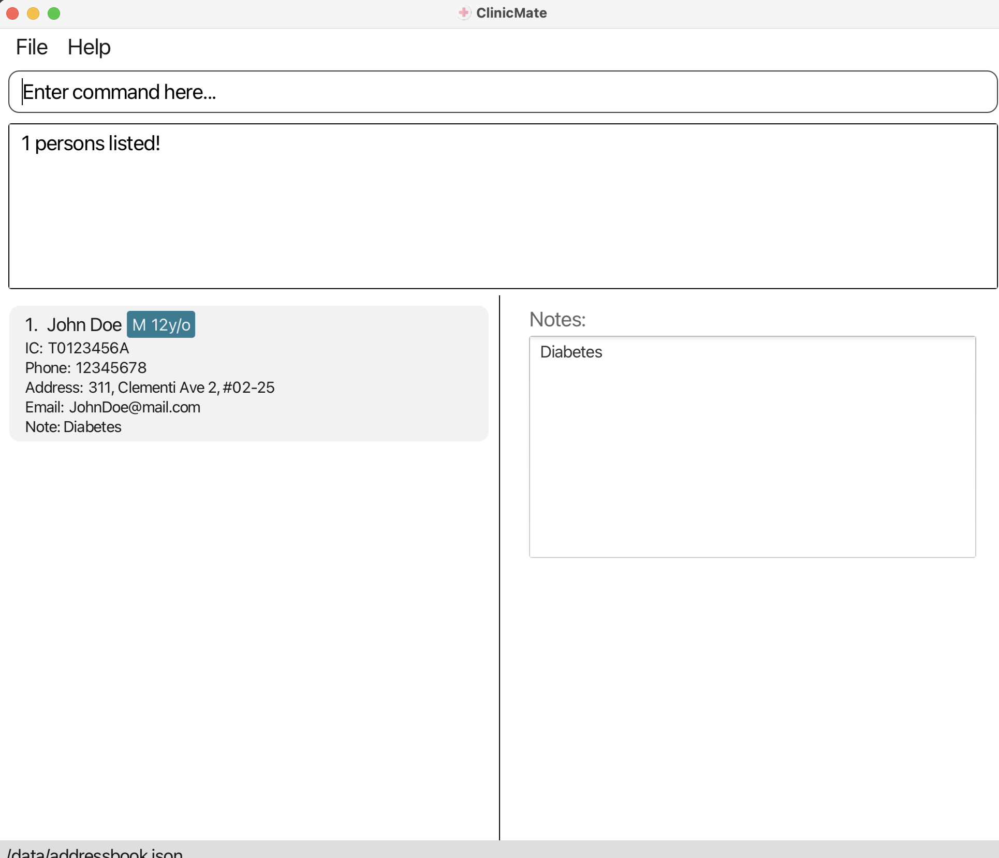
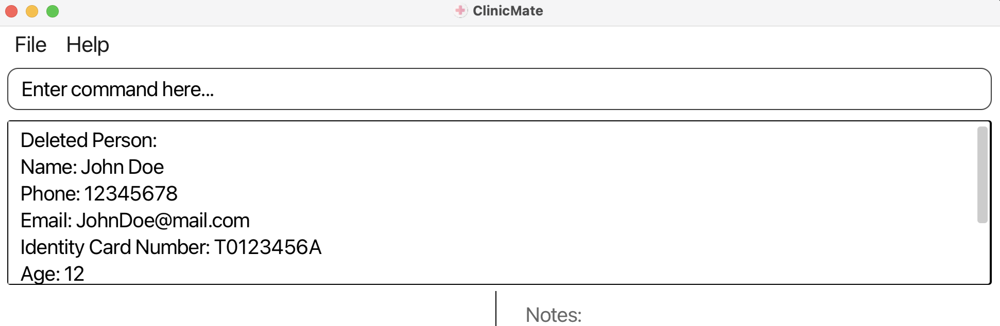
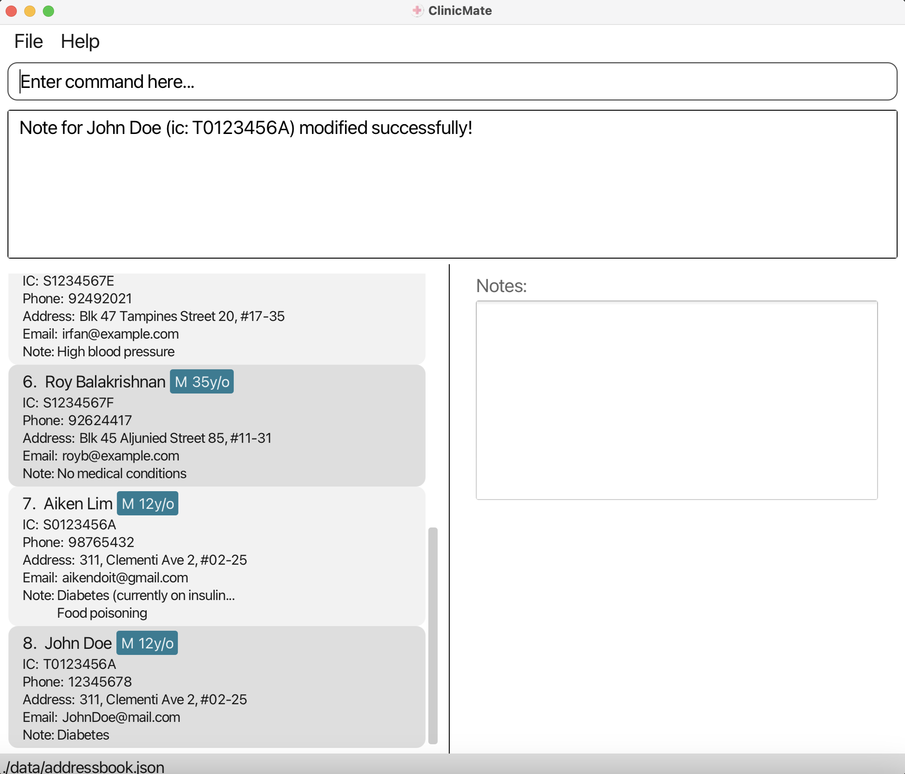

# Welcome to ClinicMate!
*Your solution to streamlining patient contact management.*

Greetings to esteemed healthcare professionals! Are you still grappling with traditional methods to manage patient details and jot down doctor's notes on paper? Are you overwhelmed by the challenge of organizing all your clinic's patient data?

Fret not! **ClinicMate** is your solution.

ClinicMate is tailor-made to streamline contact management in your clinic. Whether you're a seasoned practitioner or just starting out, ClinicMate is your indispensable companion.

This comprehensive user guide will effortlessly navigate you through ClinicMate's array of features, ensuring optimal efficiency in managing patient contacts.

Here is a **quick overview** of how ClinicMate streamlines contact management:

**Data Management Functions**:
- ***Navigation and Assistance Functions***: Reset the interface using `clear`, access comprehensive guidance through `help`, and `exit` ClinicMate with ease. 

- ***Data Management Functions***: Easily input, modify, and remove patient details through `add`, `edit` and `delete`. View detailed a comprehensive lists of patient information effortlessly with `lists` and `show` command. Effortlessly search for specific patient records with `find`.

- ***Note-Taking Function***: Use `addnote` to quickly append relevant notes to patient records for future reference.

ClinicMate is a desktop application featuring a **Command Line Interface (CLI)** with the convenience of a Graphical User Interface (GUI). Whether you're adept at typing or prefer a visual interface, ClinicMate ensures **swift and efficient** management of patient contacts.

Bid farewell to cumbersome paperwork and embrace the efficiency of ClinicMate in organizing your clinic's patient data.

<!-- * Table of Contents -->
<page-nav-print />

# Guide Usage

Welcome to the comprehensive user guide for ClinicMate! Our goal is to provide you with the knowledge and tools necessary to make the most of ClinicMate, your essential tool for clinic management. Whether you're a beginner or an experienced user, we're here to support you every step of the way.

Before we dive into the details, let's acquaint ourselves with the annotations you'll encounter throughout this user guide. These annotations will help you understand and navigate ClinicMate's features smoothly.

**:bulb: Useful Tip:** 

- Provides additional insights and tips to enhance your ClinicMate experience.

**:memo: Note:** 
- Provides valuable additional details for using ClinicMate effectively.

**:warning: Warning:** 
- Alerts you to potential pitfalls or issues to be mindful of when using ClinicMate.

 

Throughout this guide, you'll also encounter various text styles. Here's what they represent:

- _Used to illustrate possible scenarios for utilizing a feature (mostly in feature sections)._
- [Represents hyperlinks that you can click to navigate to another section of this user guide or to an external website.]()
- `Highlights specific elements such as file names, commands, or any text that should be treated as code.`
- > Provides information about the parameters that you can input into a command.

Now that you're familiar with the annotations and text styles, we will give you a tour on how to navigate this user guide based on your level of expertise.

## Quick start

### Prerequisites

1. Open Command Prompt (for Windows) or Terminal (for MacOS and Linux) on your desktop.
2. Run the command `java -version` to check if you have Java 11 or above installed in your computer.
* Assuming that you have Java installed in your computer,
  * If you have a Windows, in this case the Java version is 19.0.2.
     
  
  * If you have a Mac,  in this case the Java version is 11.0.19.
     

3. If you do not have Java 11 or above installed in your computer, download it from [here](https://www.oracle.com/java/technologies/javase-jdk11-downloads.html).

### Setting up
1. Download the latest `.jar` file [here](https://github.com/AY2324S2-CS2103T-F14-2/tp/releases/latest)
2. Copy the file to the folder you want to use as the _home folder_ for your ClinicMate.
   * e.g. if you want to use the `Documents` folder as the _home folder_ for your ClinicMate, create a new folder named `clinicmate` in the `Documents` folder.
   * You can then copy the `.jar` file to a folder named `clinicmate` in your `Documents` folder.
   

### Running the application
1. Open Command Prompt (for Windows) or Terminal (for MacOS and Linux) on your desktop.
2. Run the `cd` command into the folder you put the jar file in.
   * `cd` is the command to change directory.
   * e.g. `cd Documents/clinicmate`
3. Run the `java -jar clinicmate.jar` command to run the application. 
   A GUI similar to the below should appear in a few seconds. Note how the app contains some sample data. 
   

4. Type the command in the command box and press Enter to execute it. e.g. typing **`help`** and pressing Enter will open the help window. 
   Some example commands you can try:

   * `list` : Lists all contacts.

   * `add n\John Doe p\88888888 e\johndoe@mail.com i\T0123456A ag\12 s\Male a\John street, block 123, #01-01` : Adds a contact named `John Doe` to ClinicMate.

   * `delete T0123456A` : Deletes the contact with the IC 'T0123456A' shown in the current list.

   * `find T0123456A` : Find the contact with the IC 'T0123456A' shown in the current list.

   * `addnote T0123456A n\Patient has diabetes` : Add a note: 'Patient has diabetes' for the contact with the IC 'T0123456A' as shown in current list.
   
   * `addnote T0123456A n\Patient has diabetes -replace` : Replace the note of the contact with the IC 'T0123456A' with 'Patient has diabetes'.
   
   * `exit` : Exits the app.

5. Refer to the [Features](#features) below for details of each command.

--------------------------------------------------------------------------------------------------------------------

# Existing Features
This section gives you a step-by-step guide on how to use ClinicMate's feature. The 3 categories of ClinicMate's features are as follows:
- ***Navigation and Assistance Functions***: `clear`, `help`, `exit`

- ***Data Management Functions***:  `add`, `edit`, `delete`, `show`, `find`,list

- ***Note-Taking Function***: `addnote` 

**:memo: Note:** 

* Words in `UPPER_CASE` are the parameters to be supplied by the user. 
  e.g. in `add n\NAME`, `NAME` is a parameter which can be used as `add n\John Doe`.

* Parameters can be in any order. 
  e.g. if the command specifies `n\NAME i\IC_NUMBER`, `i\IC_NUMBER n\NAME` is also acceptable.

* Extraneous parameters for commands that do not take in parameters (such as `help`, `list`, `exit` and `clear`) will be ignored. 
  e.g. if the command specifies `help 123`, it will be interpreted as `help`.

* If you are using a PDF version of this document, be careful when copying and pasting commands that span multiple lines as space characters surrounding line-breaks may be omitted when copied over to the application.

## Navigation and Assistance Functions
Navigation and Assistance Functions in ClinicMate serve to enhance user experience and streamline workflows within the clinic management software. 

### Viewing help : `help`
*Encountering a roadblock in ClinicMate? No problem! Simply utilize the `help` command for immediate assistance and guidance.*

**Format**: `help`

**Steps**:
1. Enter `help` in the command box. A help window should pop up.
2. You can access help by either:
- Copying our User Guide's link through the **Copy URL** button.
- Directing accessing our website through pressing on the icon.

### Clearing all entries : `clear`
*Transitioning to a new clinic? Easily clear existing data from ClinicMate with a simple `clear` command!*

**Format**: `clear`

**Steps**:
1. Enter `clear` in the command box. All entries will then be cleared.

**:warning: Warning:** 
`clear` is a one-time deletion of all of your entries in ClinicMate. Please use it with consideration and care. You will not be able to retrieve any information back once command has been called.

 

### Exiting the program : `exit`

*Concluding your session? Simply use the `exit` command to gracefully exit the program and conclude your session.*

*Format*: `exit`

*Steps*:
1. Enter `exit` in the command box. You will then be directed out of ClinicMate.

**:memo: Note:** 

Don't worry about losing your data when exiting. They will be automatically saved!

## Data Management Functions ##
### Adding a person: `add`

Adds a person to ClinicMate.

Format: `add n\NAME p\PHONE e\EMAIL i\IC_NUMBER ag\AGE s\SEX a\ADDRESS`

* A person will be uniquely identified by his/her personal identification number.
* ClinicMate does not allow the same identification number to be used twice.
* A name can have the special characters `-`, `,`, `/` in it.

<box type="tip" seamless>

**Tip:** A person can have a note included (See [addnote](#adding-a-note--addnote) command).
</box>

Examples:
* `add n\John Doe p\88888888 e\johndoe@mail.com i\T0123456A ag\12 s\Male a\John street, block 123, #01-01`

What a successful `add` command looks like:

### Listing all entries : `list`
*Looking for a comprehensive overview of your patient entries in ClinicMate? Utilize the `list` command for quick access to all your patient records.*

Format: `list`

### Locating persons by ic number: `find`

Find an existing person in ClinicMate using their IC_NUMBER. Displays their contact information on the left-hand side of the screen and their full notes on the right-hand side.

Format: `find IC_NUMBER`

* Finds the person with the specified `IC_NUMBER`.
* The IC_NUMBER refers to the IC number shown in the displayed person list.
* The IC_NUMBER **must be the FULL IC NUMBER**.
* The search is case-insensitive. e.g `t0123456a` will match `T0123456A`.
* Only the IC number is searched.
* Only full IC number will be matched e.g. `T0123456A` will not match `T0123A`.

Examples:
* `find T0123456A` returns `John Doe`.

What a successful `find` command looks like:

### Changing the displayed note: `show`

There are 2 ways to use the `show` command:
1. If an IC_NUMBER is provided, displays the full note of the person with the specified IC_NUMBER on the right.
2. If no IC_NUMBER is provided, clears the note display on the right.

Format: `show [IC_NUMBER]`

For the first case where an IC_NUMBER is provided:
* Rules for valid IC_NUMBER are the same as the `find` command.
* Displays the full note of the person with the specified IC_NUMBER.
* Does NOT modify the list of persons displayed.
 
Example:
* `show T0123456A` updates the note display on the right to show `John Doe`'s note.

For the second case where no IC_NUMBER is provided:
* Clears the note display on the left.
* Does NOT modify the list of persons displayed.

Example:
* `show` clears any note that was being displayed on the right.

### Deleting a person : `delete`

Deletes the specified person from ClinicMate using their IC_NUMBER.

Format: `delete IC_NUMBER`

* Deletes the person with the specified `IC_NUMBER`.
* The IC_NUMBER refers to the IC number shown in the displayed person list.
* The IC_NUMBER **must be the FULL IC NUMBER**.
* The search is case-insensitive. e.g `t0123456a` will match `T0123456A`.
* Only the IC number is searched.
* Only full IC number will be matched e.g. `T0123456A` will not match `T0123A`.

Examples:
* `delete T0123456A` deletes `John Doe` who has `IC_NUMBER` of `T0123456A` from ClinicMate.

What a successful `delete` message looks like:

## Note-Taking Function ##

### Adding a note : `addnote`
*As doctors, it's essential to document prescriptions and notes for each patient. Simplify this process with the `addnote` command, ensuring efficient and accurate record-keeping.*

Format: `addnote IC_NUMBER n\NOTE (-replace)`

* Adds a note to the person with the specified `IC_NUMBER`. The IC number refers to the IC number shown in the displayed person list. The IC_NUMBER **must be the FULL IC NUMBER**.
* IC number must be valid and currently exist in the database.
* Existing values will be updated to the input values.
* When adding notes, the new note added will be appended to the current note of the person. i.e. current note is preserved.
* The `-replace` flag can be used to replace the current note with the new note.

Examples:
* `addnote T0123456A n\Patient has diabetes` Adds a note `Patient has diabetes` to the person with the IC number `T0123456A` in ClinicMate.
* `addnote T0123456A n\Patient has diabetes -replace` Replaces the note of the person with the IC number `T0123456A` with `Patient has diabetes`.

What a successful `addnote` command looks like:

### Saving the data

ClinicMate data are saved in the hard disk automatically after any command that changes the data. There is no need to save manually.

### Editing the data file

ClinicMate data are saved automatically as a JSON file `[JAR file location]/data/clinicmate.json`. Advanced users are welcome to update data directly by editing that data file.

<box type="warning" seamless>

**Caution:**
If your changes to the data file makes its format invalid, ClinicMate will discard all data and start with an empty data file at the next run.  Hence, it is recommended to take a backup of the file before editing it. 
Furthermore, certain edits can cause the ClinicMate to behave in unexpected ways (e.g., if a value entered is outside the acceptable range). Therefore, edit the data file only if you are confident that you can update it correctly.
</box>

--------------------------------------------------------------------------------------------------------------------

## FAQ

**Q**: When using multiple screens, moving the application to a secondary screen and later switching to using only the primary screen, the GUI opens off-screen. What do I do? 
**A**: Delete the `preferences.json` file created by the application before running the application again.

**Q**: Is there a limit to the number of patient records ClinicMate can manage? 
**A**: ClinicMate is designed to handle a large number of patient records efficiently. However, performance may vary depending on the hardware specifications of your computer and the amount of data being managed.

**Q**: How do I transfer my data to another Computer? 
**A**: Install the app in the other computer and overwrite the empty data file it creates with the file that contains the data of your previous ClinicMate home folder.

**Q**: Can I export patient data from ClinicMate for reporting or backup purposes? 
**A**: Currently, ClinicMate does not support direct export of patient data. However, you can manually copy the data from the data file located at `[JAR file location]/data/clinicmate.json` for backup or reporting purposes.

**Q**: Can I customize the fields for patient records in ClinicMate? 
**A**: ClinicMate currently supports predefined fields for patient records (name, phone, email, IC number, age, sex, address). Customization of fields is not supported in the current version.

**Q**: How secure is the patient data stored in ClinicMate? 
**A**: ClinicMate stores patient data locally on your computer in a JSON file. It is recommended to keep your computer secure and up-to-date with the latest security patches to ensure the safety of patient data.

**Q**: Is there a way to import patient data into ClinicMate from other software? 
**A**: ClinicMate does not currently support direct import of patient data from other software. However, you can manually enter patient data using the `add` command.

**Q**: Can I use ClinicMate on multiple computers? 
**A**: Yes, you can use ClinicMate on multiple computers. Simply copy the ClinicMate `.jar` file and the `clinicmate.json` data file to the other computer and run the application as usual.
--------------------------------------------------------------------------------------------------------------------
## Appendix: Planned Enhancements

1. **Support for multiple phone numbers**: Allow users to add multiple phone numbers for a single patient record.
2. **Error handling**: Improve error messages in `edit` command to check for existance of IC number in the event of empty fields.

--------------------------------------------------------------------------------------------------------------------

## Command summary

Action     | Format, Examples
-----------|----------------------------------------------------------------------------------------------------------------------------------------------------------------------
**Add**    | `add n\NAME p\PHONE e\EMAIL i\IC_NUMBER ag\AGE s\SEX a\ADDRESS`   e.g., `add n\John Doe p\88888888 e\johndoe@mail.com i\T0123456A ag\12 s\Male a\John street, block 123, #01-01`
**Clear**  | `clear`
**Delete** | `delete IC_NUMBER`  e.g., `delete T0123456A`
**Add Note** | `addnote IC_NUMBER n\NOTE (-replace)`  e.g., `addnote T0123456A n\Patient has diabetes`  e.g., `addnote T0123456A n\Patient has diabetes -replace`
**Find**   | `find IC_NUMBER`  e.g., `find T0123456A`
**Help**   | `help`
**List**   | `list`
**Exit**   | `exit`
